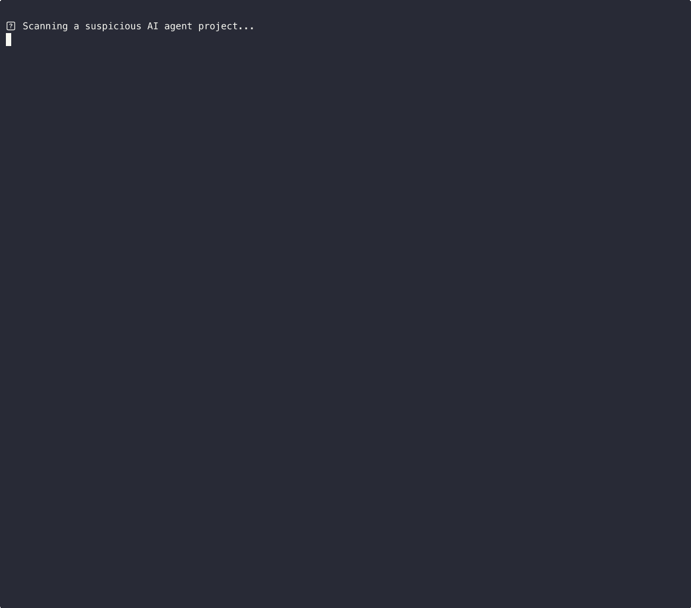

# AgentShield

[](https://www.npmjs.com/package/aiagentshield)
[](https://github.com/TakumaLee/AgentShield/blob/main/LICENSE)
[](https://github.com/TakumaLee/AgentShield/actions)

**When your AI agent has tool access, prompt injection is RCE.** AgentShield scans agent skill packages, MCP servers, and DXT extensions for supply chain poisoning, prompt injection, secret leaks, and misconfigs — before they reach production.



## 🚀 Quick Start

```bash
# Scan current directory
npx aiagentshield .

# Scan a specific agent project
npx aiagentshield ./path/to/agent

# JSON output for CI/CD
npx aiagentshield ./path/to/agent --format json
```

## Why AgentShield?

AI agents in 2026 operate with real tool access: file systems, APIs, databases, code execution. A single compromised skill package can escalate to full system access — no exploit chain required.

- **Supply chain is the new attack vector.** Agents pull skills from registries. One poisoned package = game over.
- **Zero Trust for agent tooling.** Every skill should be verified before it gets tool access.
- **Defense in depth works.** Research on 300K adversarial prompts shows multi-layer scanning drops attack success from 7% to 0.003%.

## 🔍 20 Security Scanners

AgentShield v0.8.1 ships with **20 scanners** across 5 categories:

### 🔗 Supply Chain & Code Integrity

| Scanner | What it catches |
|---------|----------------|
| **Supply Chain Scanner** | Base64 hidden commands, RCE patterns, IOC blocklist, credential theft, data exfiltration, persistence |
| **Postinstall Scanner** | Malicious `postinstall` scripts in node_modules |
| **LangChain Serialization Scanner** | Unsafe pickle/serialization deserialization in LangChain pipelines |
| **Convention Squatting Scanner** | Typosquatting, prefix hijacking, namespace confusion on skill names |

### 💉 Prompt Injection & Adversarial

| Scanner | What it catches |
|---------|----------------|
| **Prompt Injection Tester** | Known injection patterns in prompts, configs, and user-facing text |
| **Visual Prompt Injection Scanner** | Hidden instructions embedded in images (alt text, metadata, steganography) |
| **RAG Poisoning Scanner** | Repetition attacks and content poisoning in RAG knowledge bases |
| **Red Team Simulator** | Simulates common attack vectors (jailbreaks, role-play exploits, multi-turn attacks) |

### 🔐 Secrets & Data Protection

| Scanner | What it catches |
|---------|----------------|
| **Secret Leak Scanner** | API keys, tokens, passwords, private keys in code and configs |
| **Clipboard Exfiltration Scanner** | Clipboard access patterns used for data theft |
| **DNS/ICMP Tool Scanner** | Covert data exfiltration via DNS tunneling or ICMP channels |

### 🛡️ Configuration & Permissions

| Scanner | What it catches |
|---------|----------------|
| **DXT Security Scanner** | Insecure Claude Desktop Extensions — unsandboxed execution, unrestricted file/network access |
| **MCP Config Auditor** | Dangerous MCP server configurations, overprivileged tools, missing auth |
| **Agent Config Auditor** | Risky agent configurations, missing safety guardrails |
| **Hygiene Auditor** | Overly broad permissions, missing access controls, risky defaults |
| **Permission Analyzer** | Excessive permission grants, missing least-privilege enforcement |
| **Environment Isolation Auditor** | Missing sandboxing, shared environments, container escape risks |

### 🧪 Architecture & Defense

| Scanner | What it catches |
|---------|----------------|
| **Skill Auditor** | Skill package structure issues, unsafe patterns, missing validation |
| **Channel Surface Auditor** | Multi-channel attack surfaces, unprotected input channels |
| **Defense Analyzer** | Missing defense layers, gaps in security architecture |

## 📊 Security Grade

AgentShield outputs a **Security Grade** (A+ to F) based on scan results:

```
╔══════════════════════════════════════════╗
║         AgentShield Security Report      ║
╠══════════════════════════════════════════╣
║  Security Grade:  B+                     ║
║  Findings:  2 high · 5 medium · 3 low   ║
║  Scanners:  20/20 passed                 ║
╚══════════════════════════════════════════╝
```

## 🔧 CI/CD Integration

### GitHub Actions

```yaml
- name: AgentShield Security Scan
  uses: TakumaLee/AgentShield@main
  with:
    scan-path: '.'
    fail-on-critical: 'true'
    output-format: 'text'
```

#### Inputs

| Input | Description | Default |
|-------|-------------|---------|
| `scan-path` | Path to scan | `.` |
| `fail-on-critical` | Fail workflow on critical findings | `true` |
| `output-format` | Output format (`text` or `json`) | `text` |

#### Examples

```yaml
# Scan with JSON output
- uses: TakumaLee/AgentShield@main
  with:
    scan-path: './agents'
    output-format: 'json'

# Warn on critical but don't fail
- uses: TakumaLee/AgentShield@main
  with:
    fail-on-critical: 'false'
```

## 📦 Programmatic API

```typescript
import { ScannerRegistry, SupplyChainScanner, DxtSecurityScanner } from 'aiagentshield';

const registry = new ScannerRegistry();
registry.register(new SupplyChainScanner());
registry.register(new DxtSecurityScanner());

const report = await registry.runAll('./target-directory');
console.log(report.summary);
```

## IOC Blocklist

The built-in blocklist is at `src/data/ioc-blocklist.json`. Provide an external JSON file to extend it:

```bash
npx aiagentshield ./path/to/agent ./custom-ioc-blocklist.json
```

## Development

```bash
npm install
npm run build
npm test
```

## License

MIT
